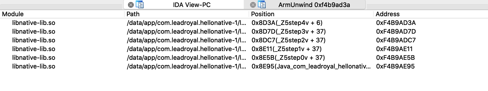
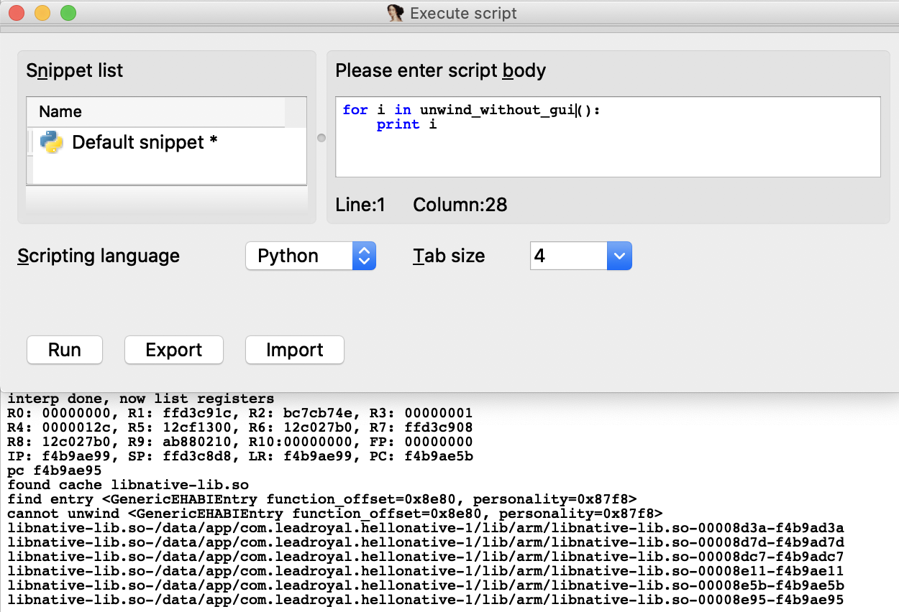

# IDA ARM Unwind Plugin

[English Version](readme_en.md)

# 功能

使用 IDA 调试 arm 调试时，打印实时的栈回溯。

IDA 的菜单栏有一处功能：`Debugger` -> `Debugger windows` -> `Stack trace (Ctrl + Alt + S)`，在调试 x86、x64、arm64 的程序时它的功能是正常的，在调试 arm 程序时它的功能是不正常的，表现出来栈回溯缺失和栈回溯错误。本质上因为 arm 使用的是自己搞的一套 `arm exception handler abi`，由 `.arm.exidx` 和 `.arm.extab` 描述；而其他 cpu 使用的是 `dwarf`，由 `.eh_frame` 描述，IDA 没有针对它做处理。本文使用 idapython 实现这个缺失的功能。

# 用法

### 1. 安装 pyelftools >= 0.27

当前最新版是0.26，该版本暂不提供 arm ehabi 的解析功能，我完善该功能后已提交 [pull request](https://github.com/eliben/pyelftools/pull/328) ，需要官方repo自行安装 [https://github.com/eliben/pyelftools](https://github.com/eliben/pyelftools) 。

```
git clone https://github.com/eliben/pyelftools.git --depth=1
cd pyelftools
python setup.py install --old-and-unmanageable
```

### 2. 加载 arm unwind plugin

### 2.1. ida script

IDA 菜单栏：`File` -> `Script File (Alt + F7)`。

IDA 菜单栏：`File` -> `Script Command (Shift + F12)` -> `python` -> `run`。

### 2.2 ida plugin

Windows: `C:\Program Files\IDA 7.x\plugins`

Mac: `/Applications/IDA Pro 7.0/idabin/plugins`

Linux: `~/ida-7.x/plugins/`

打开 ELF 文件后会在 console 里输出 `ArmUnwindPlugin init success.`

### script & plugin 区别

plugin 在 IDA 打开时就会被加载，自动绑定了快捷键 `Ctrl + Shift + U`，稍微方便一点。

script 需要手动加载，之后调用 `unwind_add_hotkey(hotkey=HOTKEY)` 来绑定快捷键。

### 3. 进行栈回溯

调试 arm32 程序，下断点，触发断点。 **【请不要下断点在函数入口】**

使用快捷键 `Ctrl + Shift + U` 或者调用 python 函数 `unwind_with_gui()`、`unwind_without_gui()`、`unwind_now(True/False)`。

输出结果在 GUI 里或者 Console 里有显示，并且函数会返回 `List[Frame]` 结构体。

效果图：GUI




效果图：console



# 提供的 API 列表

### `get_unwinder()`

return `g_arm_unwinder`

### `unwind_now(show_gui)`

根据当前状态进行 unwind。

参数：show_gui。类型：bool。意义：是否绘制 gui。

返回值：`List[Frame]`。

### `unwind_with_gui()`

根据当前状态进行 unwind，并且绘制 gui。

返回值：`List[Frame]`。

### `unwind_without_gui()`

根据当前状态进行 unwind，但不绘制 gui。

返回值：`List[Frame]`。

### `unwind_add_hotkey(hotkey=ARM_UNWIND_HOTKEY)`

为 `unwind_with_gui` 绑定快捷键。

参数：hotkey。类型：str。ida 约定的快捷键字符串，例如 `Ctrl-Shift-U`。
